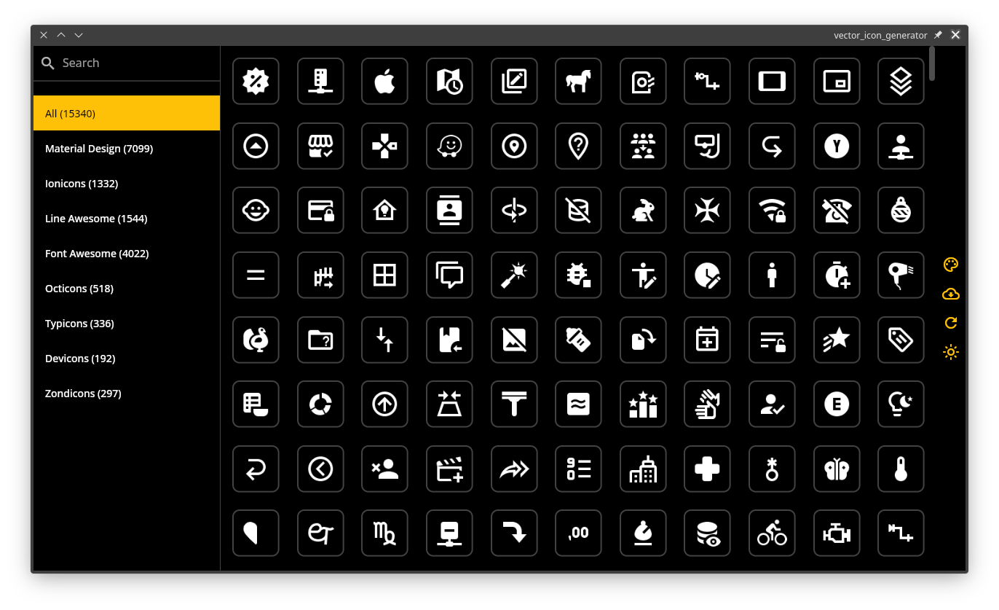

# Vector Icon Generator

Tool developed in flutter to export PNG, SVG and Android XML for popular icons.

## Supported Icons
* Community Material Design Icons - https://github.com/Templarian/MaterialDesign
* Ionicons - https://github.com/ionic-team/ionicons
* Line Awesome - https://github.com/icons8/line-awesome
* Font Awesome - https://github.com/FortAwesome/Font-Awesome
* Octicons - https://github.com/primer/octicons
* Typions - https://github.com/stephenhutchings/typicons.font
* Devicons - https://github.com/vorillaz/devicons
* Zondicons - http://www.zondicons.com

## Screenshots

## SVG processing notes
Right now only `path` element and `fill` attribute is processed, in case SVG has anything else tinting SVG and generating Android Vector XML will not work properly.